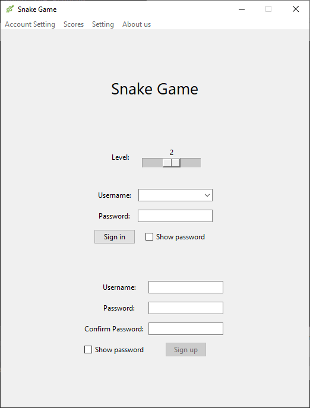
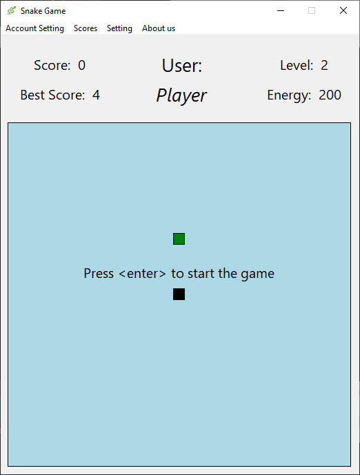

# Snake_Game_Tk

## Table of Contents:
- [About the Program](#about-the-program)
  - [Features](#features)
  - [Requirements](#requirements)
  - [Preview](#preview)
- [Reach Me](#reach-me)
- [See Also](#see-also)

## About the Program:
This is snake game with Tkinter in python!  
in this game you can do create accounts, save scores, personalize, etc. individually from other accounts  
you can play in 3 level, it's up to you 🙂    
**Please communicate with us & share your experiences, ideas and whatever else you have**

### Features:
- The energy is required for moving the snake
- Save the scores for each level & user individually
- Database is located at a secure place & also is unique (no matter where you run the game, always uses the same database)
- All the passwords are saved as hash
- Separate frames for login & game
- A variety of tables
  - my scores
  - best scores
  - records
- Manageable accounts
  - change username/password
  - reset all scores
  - delete account entirely
- Personalize your accounts
  - snake head/body color
  - background color

### Requirements:
- peewee `pip install peewee`

### Preview:
 

## Reach Me:
- [sina_programer](https://t.me/sina_programer) in telegram (when texting, please mention that you are coming from GitHub)

## See Also:
- [Python Mini Projects](https://github.com/sina-programer/Python-Mini-Projects) (a lot of thrilling stuff)
